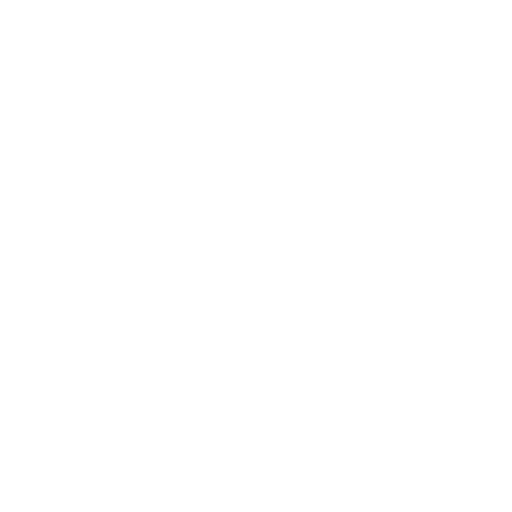
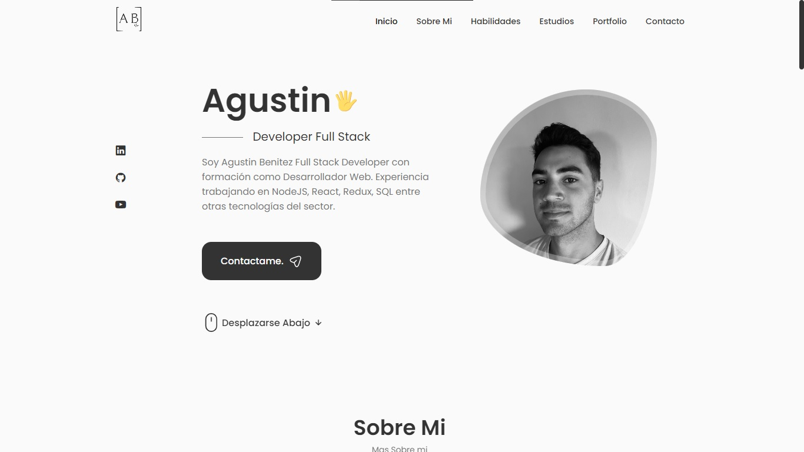
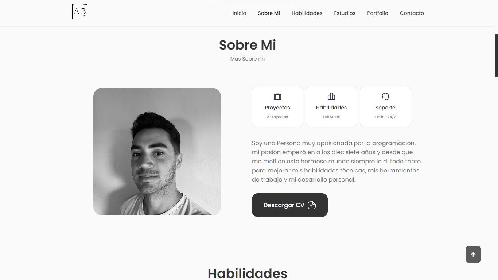
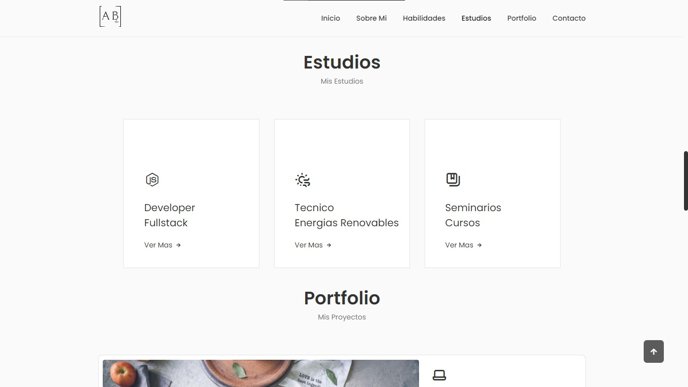
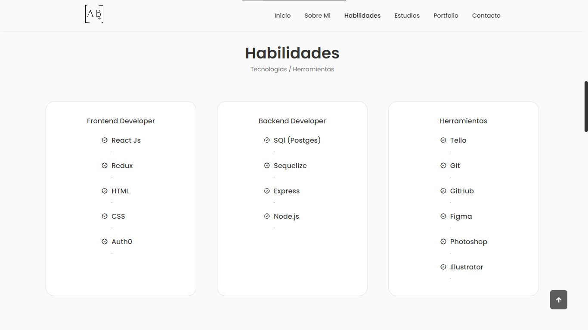
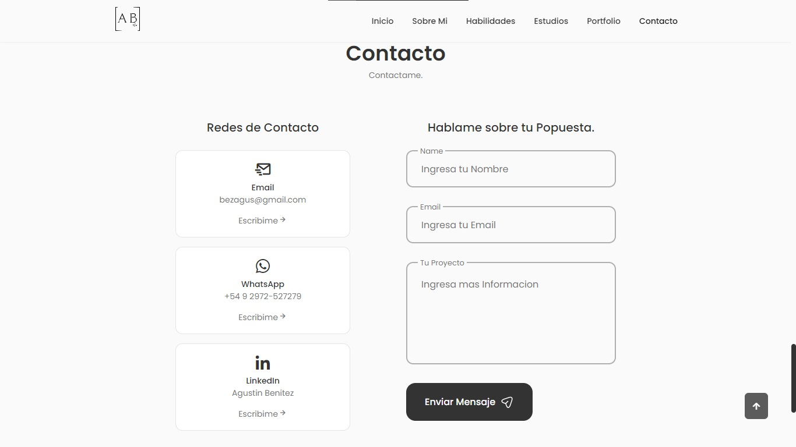
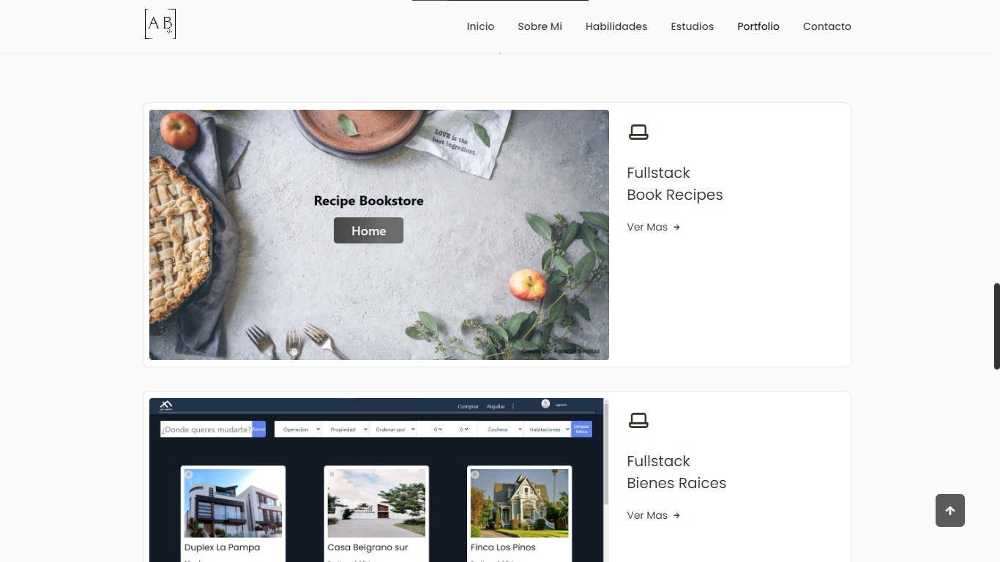

# Portfolio Personal

  

Este Proyecto esta creado con el objetivo de tranmitir mi trabajo y conocimientos a usuraios y empresas, el proyrecto es totalmente responsive para que pueda ser visto en celulares, tables y computadoras

## Tecnologias Utilizadas

- JavaScript
- React
- React Icon
- CSS
- Email.Js
- IconScout
- IconBox

## Correr Localhots

1.  Forkear el repositorio para tener una copia del mismo en sus cuentas
2.  Una vez Abierto NPM Install
3.  Luego NPM Start

## Imagenes Prototipo

- Link: https://agustinbenitez.vercel.app/
  
  
  
  
  
  
